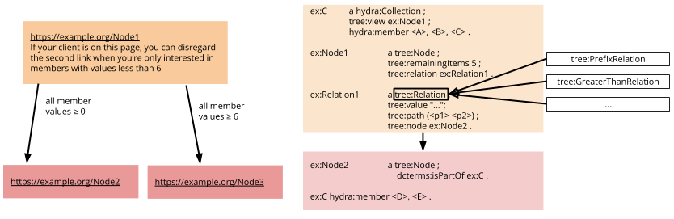

# ᴛʀᴇᴇ: hypermedia for ᴛʀiplᴇs and ᴇlements

The ᴛʀᴇᴇ vocabulary describes links to other nodes by qualifying a relation of their members to a value.

It is an alternative to a [hydra:PartialCollectionView](https://www.hydra-cg.com/spec/latest/core/#collections) or to using `next`-links. Instead, we propose to have a bit of explanation of what can be found on the next page, and let the client decide whether it is useful to follow the link or not.

## The Vocabulary

Base URI to be used: `https://w3id.org/tree#`

Preferred prefixes: `tree:` or `tiles:` (the latter makes sense if you only use the geospatial tiling specific terms) 

The full vocabulary is explained in the [RDF vocabulary](vocabulary.md).

Simple overview:

## Specifications

A couple of formal specifications can be implemented by clients to understand specific hypermedia building blocks using the [vocabulary](vocabulary.md):
 1. [Discovery](specs/1-discovery.md): how to discover a `tree:Node`
 2. [Traversing](specs/2-traversing.md) a `tree:Node`’s `tree:relation` for more specific information
 3. [Search forms](specs/3-search.md) for making certain nodes directly accessible

We are also planning to specify how to describe [Provenance and Summaries](specs/4-provenance-and-summaries.md). Feel free to pull request ideas.

Mind that a server exposing data with ᴛʀᴇᴇ __must__ [set the CORS headers](http://enable-cors.org) to allow any host.

In order to write a full ᴛʀᴇᴇ compliant client, you need to implement all building blocks, as well as the [Hydra partial collection view spec](). [Comunica](https://github.com/comunica/comunica) and its hypermedia actors will be our main reference implementation (work in progress).

See the [specs](specs/) folder for more information.

### Implementations

Neat examples can be found here:

 * Autocompletion and geo-spatial search prototype: https://dexagod.github.io
 * Routable tiles for routing over a geospatially tiled road network:
     - The initial paper: http://pieter.pm/demo-paper-routable-tiles/
     - Calculating an isochrone demo with user-feedback while querying: http://hdelva.be/isochrone/demo.html

Also in the example folder in here, we’ve taken the effort to illustrate a couple of use cases:
 * [An ordered collection of pages](examples/paged-collection-with-order/)
 
## Questions and Answers

### Why publish a hypermedia structure?

When a document grows too large for 1 HTTP response, we need to fragment it. The way we fragment it will immediatly decide what queries will be fast and which queries will be slow.
Hypermedia can be used to hit the sweet spot between data dumps and querying APIs (such as GraphQL or SPARQL). It is particularly a sweet spot for Open Data publishers that need a cost-efficient way of publishing their data, while allowing third parties to create serverless applications to reuse the data.

|   | dump  | ᴛʀᴇᴇ fragments  | query  |
|:-:|:-:|:-:|:-:|
| processing | client | shared | server |
| server cost  | low  | okay  | high  |
|  client cost | high  | okay  | low  |
| caching | low | high | low |
| query execution control | high | high | low |

### Why hypermedia?

When you write a client for one server, you can get away with hard-coding the way the API is built based on the API specification. When building a client for the entire Web, we need to make very general specifications that still allow our client to understand what it can do next. The latter are called the hypermedia controls.

### What are triples? JSON-LD? RDF? URIs? Linked Data?

Same idea as hypermedia, only for understanding the elements in the pages itself. See [these intro slides](https://speakerdeck.com/pietercolpaert/an-introduction-to-open-data), or [read this chapter](https://phd.pietercolpaert.be/chapters/data-and-interoperability).
